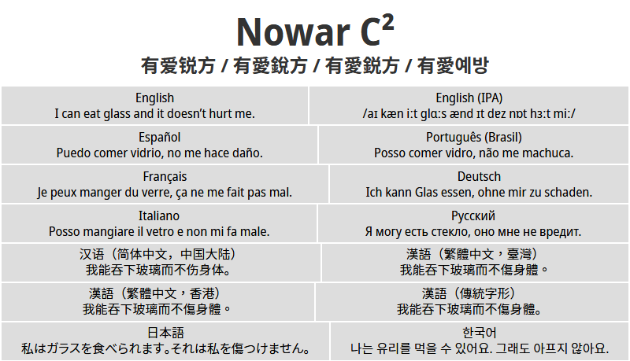
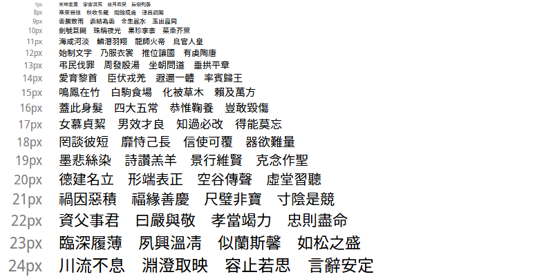

**English** [简体中文](README-Hans.md) [繁體中文](README-Hant.md)

# Nowar C² (Nowar Clear & Crisp)

Nowar C², well hinted font packs for _World of Warcraft_ and _WoW Classic_ that support all client languages.

> Make Love, Not Warcraft.<br>
> 要有爱，不要魔兽争霸。<br>
> 要愛，不要魔獸。





## Download the Fonts

[Latest release at GitHub](https://github.com/nowar-fonts/Nowar-CnC/releases)

Mirrors: [Gitee (release repo)](https://gitee.com/nowar-fonts/Nowar-CnC)

Nowar C² is shipped in 5 weights and 7 regional variants, with several features.

### Weights

* 200: ExtraLight
* 300: Light
* 400: Regular
* 500: Medium
* 700: Bold
* [Morpheus (European display font) may be bolder or lighter.]

### Regional Variants

CN, TW, HK, JP and KR are “standard variants”, which have full character set support with regional Chinese character orthographies.

|    | European            | 简体中文       | 繁體中文  | 한국어        |
| -- | ------------------- | -------------- | --------- | ------------- |
| CN | Mainland China (UI) | Mainland China | Taiwan    | S. Korea (UI) |
| TW | Taiwan (UI)         | Mainland China | Taiwan    | S. Korea (UI) |
| HK | Hong Kong (UI)      | Mainland China | Hong Kong | S. Korea (UI) |
| JP | Japan (UI)          | Mainland China | Taiwan    | S. Korea (UI) |
| KR | S. Korea (UI)       | Mainland China | Taiwan    | S. Korea (UI) |

CL, the “classical variant”, have full character set support with classical Chinese character orthography (aka Kāngxī Dictionary forms).

|     | European       | 中文      | 한국어         |
| --- | -------------- | --------- | -------------- |
| CL  | Classical (UI) | Classical | Classical (UI) |

GB is a variant that supports a superset of Chinese national standard GB 18030-2000. The GB distributions aim at smaller size by removing Hangul support.

|    | European            | 中文           | 한국어 |
| -- | ------------------- | -------------- | ------ |
| GB | Mainland China (UI) | Mainland China | N/A    |

* European: English, Español (AL), Português, Deutsch, Español (EU), Français, Italiano, and Русский.
* UI: Ambiguous punctations are treated as Western; CJK puctations are half-width.

### Features

| Tag | Name        | Description                                                            |
| --- | ----------- | ---------------------------------------------------------------------- |
| OSF | Oldstyle    | Oldstyle (non-lining), propotional figure.                             |
| SC  | Smallcaps   | Small capitals for Latin.                          |
| RP  | Roleplaying | `丶` (U+4E36) is mapped to the same glyph as `·` (U+00B7, MIDDLE DOT). |

Pre-built feature variants: `CL,OSF`, `CL,SC`, `GB,RP`.

## How to Build

### Dependencies

* Basic Unix utils;
* [Python](https://www.python.org/);
* [otfcc](https://github.com/caryll/otfcc);
* [ttfautohint](https://www.freetype.org/ttfautohint/);
* [Node.js](https://nodejs.org/);
* [7-Zip](https://www.7-zip.org/) (add to `PATH`).

When dependencies installed, run `npm install` for extra packages.

Note: choose 64-bit version if possible. 32-bit version may lead to out-of-memory issue.

### Customize Build System

By default, the build system will build and hint all fonts, which costs much time (~20 hours with `-j8`) and disk space (more than 100 GiB).

To build exactly what you need, modify `configure.py`:
```python
class Config:
    # remove weights you don’t need
    fontPackWeight = [ 200, 300, 400, 500, 700 ]

    # don’t touch it
    fontPackFeature = [ "OSF", "SC", "RP" ]

    # set regional and feature variants here.
    # items in fontPackVariant can be
    #   a regional variant, or
    #   a tuple of regional variant and feature list
    # if there are feature variants, feature tags must be identically ordered as in fontPackFeature.
    # e.g. `("CN", [ "OSF", "RP" ])`
    fontPackVariant = [
        "CN", "TW", "HK", "JP", "KR",
        "CL", ("CL", [ "OSF" ]), ("CL", [ "SC" ]),
        "GB", ("GB", [ "RP" ]),
    ]

# if you want to customize regional variant, add it here.
regionalVariant = { ... }
```

For example, “I enjoy Japna’s orthography, and I’d like to apply it to every language!”
```python
class Config:
    fontPackWeight = [ 400 ]
    fontPackRegion = [ "JPeverywhere" ]

regionalVariant = { 
    "JPeverywhere": {
        "Latn": "JP",
        "Hans": "JP",
        "Hant": "JP",
        "ko": "JP",
    }
}
```

Then, run `python configure.py` to generate `Makefile`.

### Build Your Flavor

Put Source Han Sans OTF files to `source/shs/`. Then, run
```bash
make -j<threads> IDH_JOBS=<threads>
```

The font pack will be in `out/`.

## Credit

Latin, Greek and Cyrillic characters are from [Noto Sans](https://github.com/googlei18n/noto-fonts) by Google.

CJK Ideographs, Kana and Hangul are from [Source Han Sans](https://github.com/adobe-fonts/source-han-sans) by Adobe.

Ideograph is autohinted with [Chlorophytum](https://github.com/chlorophytum/Chlorophytum).
